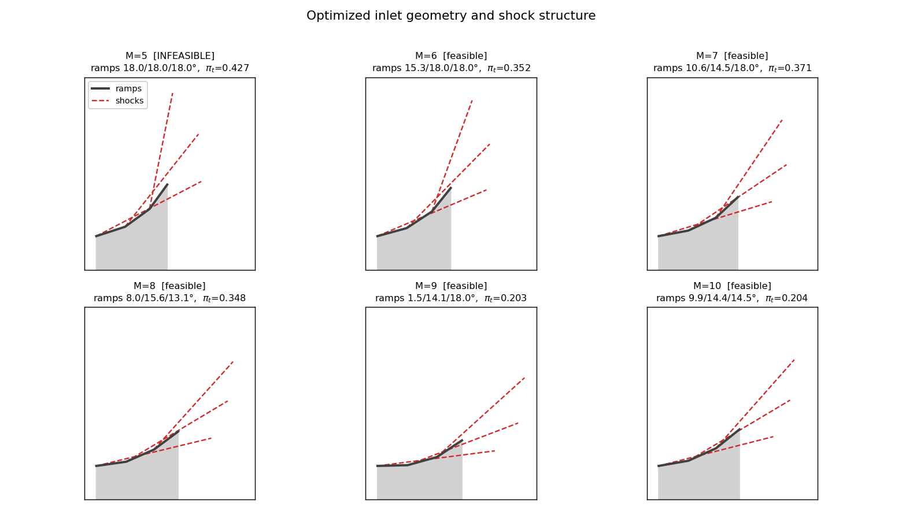
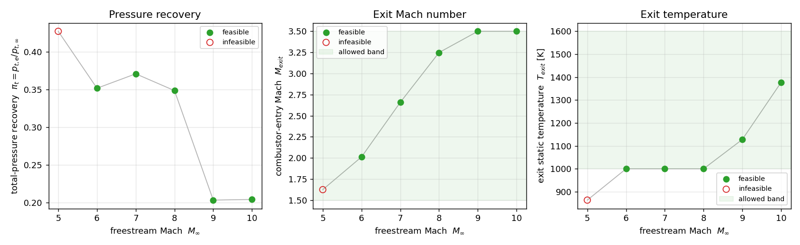

# scramjet-inlet-ramp-optimizer


> **Executive Summary:** A real-gas, variable-geometry inlet design tool for a multi-ramp scramjet. A 2D oblique-shock solver with **equilibrium high-temperature thermochemistry** (vibrational excitation and chemical dissociation via **Cantera**) marches the freestream through a ramp shock train, and a constrained optimizer (**SciPy SLSQP**) finds the ramp angles that **maximize total-pressure recovery** while holding the combustor-entry Mach number and static temperature inside the window required for fuel auto-ignition. Each flight Mach number is optimized independently to produce a variable-geometry schedule.

---

## Introduction

This project provides a baseline for the aerothermodynamic design of external-compression scramjet inlets, where the static temperatures behind the compression shocks are high enough that calorically-perfect-gas relations no longer hold. Rather than applying the textbook $\theta$–$\beta$–$M$ relation, the solver enforces the conservation laws directly across each shock and closes them with a real-gas equation of state, capturing the vibrational excitation and dissociation that soften the effective ratio of specific heats at scramjet conditions.

The optimizer treats the inlet as a non-linear constrained problem: maximize the total-pressure recovery $\pi_t = p_{t,\text{exit}}/p_{t,\infty}$ subject to bounds on the combustor-entry Mach number and a floor on the static temperature for auto-ignition. The geometry is re-optimized at each freestream Mach number, modeling a variable-geometry ramp, and the per-Mach results expose where the binding constraint shifts and where the design becomes physically infeasible.

## Physics & Modeling Methodology

The central modeling decision is that **oblique shocks are not solved with perfect-gas relations**. Each oblique shock is treated as a rotated normal shock: the upstream velocity is decomposed into components normal and tangential to the wave, the tangential component is conserved, and the normal component is processed through a real-gas normal-shock jump that enforces conservation of mass, normal momentum, and energy,

$$\rho_1 u_{1n} = \rho_2 u_{2n}, \qquad p_1 + \rho_1 u_{1n}^2 = p_2 + \rho_2 u_{2n}^2, \qquad h_1 + \tfrac{1}{2}u_{1n}^2 = h_2 + \tfrac{1}{2}u_{2n}^2 .$$

With $y = \rho_1/\rho_2$ this closes to $p_2 = p_1 + \rho_1 u_{1n}^2(1-y)$ and $h_2 = h_1 + \tfrac{1}{2}u_{1n}^2(1-y^2)$, with the gas re-equilibrated at $(h_2, p_2)$ to return a new density; the density ratio is iterated to convergence. The flow-deflection angle is then *recovered* from the post-shock velocity, $\theta = \beta - \arctan(u_{2n}/u_{1t})$, rather than assumed.

The wave angle for a target ramp deflection is found by a root solve on $\beta$, bracketed between the Mach angle and the wave angle of maximum deflection (the weak/strong boundary) so the weak-shock branch is selected and genuine shock detachment is detected. Total-pressure recovery is computed from **real-gas stagnation pressures** — each state is isentropically decelerated to rest at constant entropy and total enthalpy — using a Newton iteration with the exact thermodynamic derivative $\left(\partial h/\partial p\right)_s = 1/\rho$, which converges in a few equilibrations independent of Mach number.

This simulation makes a number of physical and numerical assumptions, expanded on below.

* **2D, inviscid, attached flow:** The external compression ramps are modeled as a planar oblique-shock train. Boundary layers, shock–boundary-layer interaction, the cowl shock, and the internal isolator are not modeled.
* **Equilibrium chemistry:** The gas is chemically equilibrated behind each shock and during stagnation (`equilibrate('HP')` / `equilibrate('SP')`). Finite-rate kinetics and frozen-flow limits are not modeled, though the stagnation calculation can be switched to frozen with a one-line change.
* **Real-gas thermochemistry via Cantera:** Vibrational excitation and dissociation are captured through temperature-dependent thermodynamics and equilibrium composition. A high-temperature air mechanism (NASA-9 polynomials, valid to ~20,000 K) is required; the default `air.yaml` (valid only to 3500 K) will extrapolate and is not recommended above the mid-Mach range.
* **Frozen sound speed for Mach number:** The local Mach number uses $a = \sqrt{\gamma p/\rho}$ with $\gamma = c_p/c_v$.
* **1976 US Standard Atmosphere:** Freestream static conditions are taken from the ISA model at the specified altitude.
* **Ramp lengths are not design variables:** The optimizer sets ramp *angles* only. Geometry figures use uniform ramp segment lengths, so they are schematics of the angles (deflections and wave angles), not a shock-on-cowl-lip layout.

The optimization is a constrained non-linear program solved with **Sequential Least-Squares Quadratic Programming (SLSQP)**. The objective is the negative recovery; the per-ramp angles are bounded; and the combustor-entry Mach number and static temperature are imposed as inequality constraints,

$$\min_{\boldsymbol{\theta}} \; -\pi_t(\boldsymbol{\theta}) \quad \text{s.t.} \quad M_{\min} \le M_{\text{exit}} \le M_{\max}, \quad T_{\min} \le T_{\text{exit}} \le T_{\max}, \quad \theta_{\min} \le \theta_i \le \theta_{\max}.$$

A small multi-start (shallow / equal / steep seed geometries) guards against local optima, and a cache collapses the objective and all constraints at one geometry into a single inlet solve. When no geometry satisfies both exit constraints, the case is reported as infeasible rather than silently clipped.

## Example Results and Brief Discussion

The driver sweeps integer freestream Mach numbers and optimizes the ramp geometry at each, writing the figures below.

<p align="center">
  
</p>

<p align="center">
  
</p>

Several physically meaningful behaviors emerge directly from the optimization:

* **The Oswatitsch optimum is recovered, not assumed.** At the feasible design points the optimizer drives the per-shock total-pressure ratios to be nearly equal — the classical result for the most efficient shock train — from real-gas physics rather than an imposed rule.
* **The binding constraint shifts with Mach number.** At low-to-mid Mach the static-temperature floor binds (maximizing recovery wants the weakest shocks, so the design sits exactly on the auto-ignition limit). At high Mach the exit-Mach ceiling takes over: capping $M_{\text{exit}}$ forces extra compression, raising the exit temperature above the floor and lowering recovery.
* **Low-Mach infeasibility is real, not numerical.** At low flight Mach the freestream stagnation temperature is low enough that the combustor-entry Mach floor and the auto-ignition temperature floor cannot be satisfied simultaneously; the optimizer correctly flags these points, exposing the lower operability limit of the inlet.

## Limitations

The inviscid, equilibrium, 2D model is a design-screening tool, and several improvements would increase fidelity. Viscous effects, shock–boundary-layer interaction, and the internal (cowl-side and isolator) compression are not modeled, so the predicted recovery is an inviscid upper bound. Equilibrium chemistry is an idealization — at the residence times and pressures of a real inlet the flow can be partially frozen, which a finite-rate kinetics treatment would capture. Ramp lengths and the shock-on-lip focusing condition are outside the optimization, so the geometries are angle schedules rather than complete inlet layouts. Finally, ionization is not included, which bounds the valid range to roughly neutral-air temperatures (below ~6000 K), comfortably covering the cases studied here but not arbitrarily high flight Mach.

---

## Repository Structure

The physics/optimization and the visualization pipelines are decoupled: `main.py` runs the solve and exports a results file, and `plotting.py` reads that file and renders the figures. This keeps figure styling iterable without paying for a solve, and isolates the Cantera-dependent code from the plotting code.

* `main.py` — Sweep driver. Pulls freestream conditions from the atmosphere model, optimizes the ramp geometry at each Mach number, prints a summary, and exports `data/results.json`.
* `optimizer.py` — Constrained recovery maximization (`optimize_scramjet_inlet`) using multi-start SLSQP with a cached inlet solve.
* `solveShock.py` — Real-gas core: normal/oblique-shock jump, weak-shock wave-angle solve with detachment detection, Newton-based real-gas stagnation pressure, and the multi-ramp inlet march (`solve_inlet`).
* `createGas.py` — Thin Cantera wrapper (`realGas`) exposing the thermodynamic state used by the solver.
* `atmosphere.py` — Standalone 1976 US Standard Atmosphere calculator.
* `plotting.py` — Visualization: per-case inlet geometry (ramps + shocks) and performance trends (recovery, exit Mach, exit temperature vs freestream Mach). Runnable standalone from the saved data file.
* `data/results.json` — Exported results (per-case geometry and exit conditions plus the constraint metadata used to shade the plots).

---

## Installation & Usage

### Dependencies

Cantera is most reliably installed via `conda`, though pip wheels are available for most platforms. A high-temperature air mechanism (NASA-9 polynomials) is required for validity above the mid-Mach range and ships with Cantera as `airNASA9.yaml`.

```bash
conda install -c conda-forge cantera
pip install numpy scipy matplotlib
```

### Running

```bash
python main.py        # runs the Mach sweep, writes data/results.json and the figures
python plotting.py    # regenerates the figures from data/results.json (no solve, no Cantera needed)
```

Key parameters are set at the top of `main.py`: the altitude `H`, the Mach list `MACH_LIST`, the number of ramps `N_RAMPS`, and the fixed constraint set (`M_EXIT_RANGE`, `T_EXIT_RANGE`, `RAMP_ANGLE_RANGE`). The constraint defaults correspond to a hydrogen-fueled design window; lowering the combustor-entry Mach floor is what opens up the lower flight-Mach range. `plotting.py` depends only on NumPy and Matplotlib, so figure tweaks can be done in an environment without Cantera installed.

Disclamer: This cover page has been made with the help of external agents to ease readability and comprehensiveness.